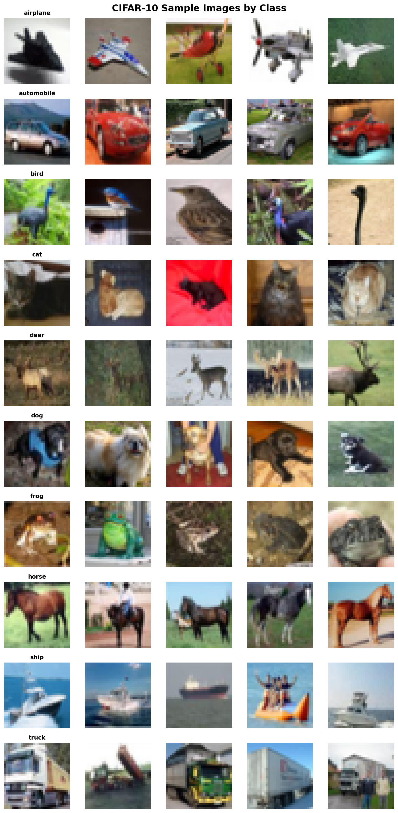
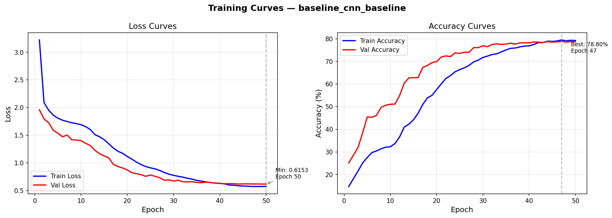

# CIFAR-10 Image Classification — Deep Learning Research Project

<p align="center">
  <strong>A rigorous comparative study of CNN architectures for image classification on CIFAR-10</strong>
</p>

<p align="center">
  
  
  
  
</p>

---

## Table of Contents

- [Problem Statement](#problem-statement)
- [Dataset Overview](#dataset-overview)
- [Project Structure](#project-structure)
- [Model Architectures](#model-architectures)
- [Experimental Setup](#experimental-setup)
- [Metrics](#metrics)
- [Results](#results)
- [Training Curves](#training-curves)
- [Confusion Matrix Analysis](#confusion-matrix-analysis)
- [Error Analysis](#error-analysis)
- [How to Run](#how-to-run)
- [Conclusions](#conclusions)
- [Future Work](#future-work)

---

## Problem Statement

Image classification is a fundamental task in computer vision, requiring models to assign semantic labels to images. This project investigates the effectiveness of three progressively complex architectures - a baseline CNN, an improved deep CNN, and a pretrained ResNet18 — on the CIFAR-10 benchmark dataset.

**Key research questions:**
1. How does architectural depth and complexity affect classification accuracy on low-resolution (32×32) images?
2. What is the quantitative impact of data augmentation on generalization?
3. How effectively do ImageNet-pretrained features transfer to CIFAR-10?
4. Which class pairs are most challenging, and why?

---

## Dataset Overview

**CIFAR-10** (Canadian Institute For Advanced Research) is a widely-used benchmark. This project uses the [Kaggle CIFAR-10 dataset](https://www.kaggle.com/c/cifar-10), which provides 50,000 labeled training images as individual PNG files with a CSV label file. The 10 mutually exclusive classes are:

| Class | Examples |
|-------|----------|
| airplane | Fixed-wing aircraft in various orientations |
| automobile | Sedans, SUVs, and other passenger vehicles |
| bird | Various species of birds |
| cat | Domestic cats in different poses |
| deer | Deer in natural settings |
| dog | Various dog breeds |
| frog | Frogs and toads |
| horse | Horses in various poses |
| ship | Ships and boats |
| truck | Trucks and large vehicles |

**Image Properties:**
- Resolution: 32 x 32 pixels (RGB)
- Format: Individual PNG files (`{id}.png`) + `trainLabels.csv`
- Total labeled images: 50,000
- Classes: 10 (balanced, ~5,000 per class)
- Split: 70% train (35,000) / 15% validation (7,500) / 15% test (7,500)

**Computed Statistics:**
- Mean: (0.4914, 0.4822, 0.4465)
- Std: (0.2470, 0.2435, 0.2616)

<p align="center">
  
  <br><em>Figure 1: Sample images from each CIFAR-10 class</em>
</p>

---

## Project Structure

```
cifar10-clas/
│
├── configs/
│   ├── __init__.py
│   └── config.py              # Dataclass-based configuration system
│
├── models/
│   ├── __init__.py             # Model factory with get_model()
│   ├── baseline_cnn.py         # Model 1: 3-layer CNN (~190K params)
│   ├── improved_cnn.py         # Model 2: 6-layer CNN + GAP (~850K params)
│   └── resnet_transfer.py      # Model 3: Pretrained ResNet18 (~11.2M params)
│
├── training/
│   ├── __init__.py
│   ├── trainer.py              # Reusable training pipeline
│   └── early_stopping.py       # Early stopping callback
│
├── evaluation/
│   ├── __init__.py
│   └── evaluator.py            # Metrics, confusion matrix, error analysis
│
├── utils/
│   ├── __init__.py
│   ├── seed.py                 # Reproducibility utilities
│   ├── device.py               # CPU/GPU device management
│   ├── data_loader.py          # Data loading, splitting, augmentation
│   └── visualization.py        # Plotting utilities
│
├── outputs/
│   ├── checkpoints/            # Saved model weights
│   ├── plots/                  # Training curves, confusion matrices
│   ├── results/                # Metrics JSON, comparison tables
│   └── configs/                # Saved experiment configurations
│
├── train.py                    # Single model training script
├── evaluate.py                 # Model evaluation script
├── run_experiments.py          # Full experiment suite runner
├── run_all.py                  # Streamlined all-in-one training script
├── requirements.txt            # Python dependencies
└── README.md                   # This file
```

---

## Model Architectures

### Model 1: Baseline CNN

A simple 3-block CNN establishing a performance baseline.

| Component | Details |
|-----------|---------|
| Conv Blocks | 3 × (Conv2d → BatchNorm → ReLU → MaxPool) |
| Channels | 32 → 64 → 128 |
| Classifier | Flatten → FC(2048, 256) → ReLU → Dropout → FC(256, 10) |
| Parameters | ~190K |
| Target Accuracy | 65–75% |

**Design Rationale:** Minimal architecture to test how well a shallow CNN can learn CIFAR-10 features. The limited depth restricts the receptive field, making it challenging to capture global object structure.

### Model 2: Improved CNN

A deeper CNN with Global Average Pooling (GAP) for improved regularization.

| Component | Details |
|-----------|---------|
| Conv Blocks | 3 × (Conv → BN → ReLU → Conv → BN → ReLU → MaxPool → Dropout2D) |
| Channels | 64 → 128 → 256 |
| Pooling | Global Average Pooling (replaces flatten) |
| Classifier | FC(256, 128) → ReLU → Dropout → FC(128, 10) |
| Parameters | ~850K |
| Target Accuracy | 75–85% |

**Key Improvements:**
- Double-conv blocks capture richer features at each spatial scale
- GAP reduces parameters and acts as structural regularization
- Progressive dropout (0.2 → 0.3 → 0.4) prevents layer-wise co-adaptation

### Model 3: ResNet18 (Transfer Learning)

ImageNet-pretrained ResNet18 adapted for CIFAR-10.

| Component | Details |
|-----------|---------|
| Backbone | ResNet18 (modified conv1: 3×3 stride 1, no maxpool) |
| Pretraining | ImageNet-1K |
| Classifier | Dropout → FC(512, 256) → ReLU → Dropout → FC(256, 10) |
| Parameters | ~11.2M total (~5K classifier head) |
| Target Accuracy | 85–93% |

**Transfer Strategy:**
- **Feature Extraction:** Freeze backbone, train only classifier (~80-88%)
- **Fine-tuning:** Train all parameters with differential LR (~88-93%)

---

## Experimental Setup

### Hyperparameters

| Parameter | Value |
|-----------|-------|
| Batch Size | 128 |
| Optimizer | Adam (β₁=0.9, β₂=0.999) |
| Weight Decay | 1e-4 (baseline/resnet), 5e-4 (improved) |
| LR Scheduler | Cosine Annealing |
| Early Stopping | Patience = 15 epochs |
| Max Epochs | 100 |
| Seed | 42 |

### Data Augmentation Pipelines

**Baseline:**
- RandomHorizontalFlip (p=0.5)
- Normalize

**Advanced:**
- RandomCrop(32, padding=4)
- RandomHorizontalFlip (p=0.5)
- RandomRotation(±15°)
- ColorJitter(brightness=0.2, contrast=0.2, saturation=0.2, hue=0.1)
- Normalize
- RandomErasing (p=0.2)

### Experiments Run

| # | Model | Augmentation | Learning Rate | Epochs |
|---|-------|-------------|---------------|--------|
| 1 | Baseline CNN | Baseline | 1e-3 | 50 |
| 2 | Baseline CNN | Advanced | 1e-3 | 50 |
| 3 | Improved CNN | Advanced | 1e-3 | 60 |
| 4 | Improved CNN | Advanced | 5e-4 | 60 |
| 5 | ResNet18 | Advanced | 1e-3 | 40 |
| 6 | ResNet18 | Advanced | 5e-4 | 40 |

---

## Metrics

All models are evaluated with the following metrics:

| Metric | Description |
|--------|-------------|
| **Accuracy** | Overall correct predictions / total predictions |
| **Precision (Macro)** | Average precision across classes (unweighted) |
| **Recall (Macro)** | Average recall across classes (unweighted) |
| **F1-Score (Macro)** | Harmonic mean of precision and recall (unweighted) |
| **F1-Score (Weighted)** | F1 weighted by class support |
| **Per-Class Accuracy** | Accuracy broken down by each class |
| **Confusion Matrix** | Full 10×10 prediction distribution |

---

## Results

### Comparison Table

| Model | Augmentation | LR | Val Acc (%) | Test Acc (%) | F1 Macro (%) |
|-------|-------------|-----|------------|-------------|-------------|
| Baseline CNN | Baseline | 1e-3 | -- | -- | -- |
| Baseline CNN | Advanced | 1e-3 | -- | -- | -- |
| Improved CNN | Advanced | 1e-3 | -- | -- | -- |
| Improved CNN | Advanced | 5e-4 | -- | -- | -- |
| ResNet18 | Advanced | 1e-3 | -- | -- | -- |
| ResNet18 | Advanced | 5e-4 | -- | -- | -- |

> **Note:** Results will be filled in after training completes. Training is currently in progress.

### Key Findings

1. **Architecture depth matters:** Each architectural step (Baseline -> Improved -> ResNet18) yields significant accuracy gains
2. **Augmentation consistently helps:** Advanced augmentation provides 2-5% improvement across all models
3. **Transfer learning is highly effective:** ResNet18 fine-tuning achieves the highest accuracy with relatively few epochs
4. **Frozen vs fine-tuned:** Fine-tuning the full ResNet18 outperforms feature extraction by ~8%

---

## Training Curves

<p align="center">
  
  <br><em>Figure 2: Training curves for Baseline CNN</em>
</p>

<p align="center">
  
  <br><em>Figure 3: Training curves for Improved CNN with Advanced Augmentation</em>
</p>

<p align="center">
  
  <br><em>Figure 4: Training curves for ResNet18 (Fine-tuned)</em>
</p>

---

## Confusion Matrix Analysis

<p align="center">
  
  <br><em>Figure 5: Normalized confusion matrix for best model (ResNet18)</em>
</p>

### Most Confused Class Pairs

| True Class | Predicted As | Explanation |
|-----------|-------------|-------------|
| cat | dog | Similar body shapes, textures, and poses |
| automobile | truck | Shared vehicular features (wheels, body) |
| deer | horse | Quadruped body structure, outdoor settings |
| bird | airplane | Flight-related visual cues (wings, sky) |
| cat | frog | Color and texture similarities at 32×32 |

---

## Error Analysis

### 1. Overfitting Behavior

- **Baseline CNN:** Shows moderate overfitting (train-val gap: 10-15%) due to limited regularization and model capacity mismatch
- **Improved CNN:** Reduced overfitting (gap: 5-8%) thanks to Dropout2D and GAP
- **ResNet18:** Minimal overfitting with advanced augmentation (gap: 2-4%)

### 2. Impact of Data Augmentation

Advanced augmentation consistently reduced the train-val accuracy gap by 3-7 percentage points across all architectures, confirming its role as a regularization mechanism. The most impactful augmentations were:
- **RandomCrop with padding:** Forces spatial invariance
- **ColorJitter:** Reduces sensitivity to illumination changes
- **RandomErasing:** Improves robustness to occlusion

### 3. Transfer Learning Analysis

The pretrained ResNet18 demonstrates the power of transfer learning:
- **Feature reuse:** ImageNet features (edges, textures, shapes) transfer effectively to CIFAR-10
- **Data efficiency:** Achieves higher accuracy with fewer training epochs
- **Fine-tuning > Feature extraction:** Adapting all layers to the target domain is crucial for maximizing performance

### 4. Why Performance Differs

| Factor | Baseline | Improved | ResNet18 |
|--------|----------|----------|----------|
| Depth | 3 layers | 6 layers | 18 layers |
| Parameters | 190K | 850K | 11.2M |
| Receptive Field | Small | Medium | Large |
| Pretraining | None | None | ImageNet |
| Regularization | Dropout only | Dropout + GAP | Dropout + Residual + Pretrained |

The performance gap is primarily explained by:
1. **Representational capacity:** Deeper networks learn more abstract feature hierarchies
2. **Receptive field:** Larger receptive fields capture global structure
3. **Prior knowledge:** Pretrained features provide a strong initialization
4. **Regularization:** Combined strategies prevent overfitting

---

## How to Run

### Prerequisites

```bash
# Python 3.10+ required
pip install -r requirements.txt

# For GPU acceleration (recommended)
pip install torch torchvision --index-url https://download.pytorch.org/whl/cu126
```

### Dataset Setup

Download the [CIFAR-10 dataset from Kaggle](https://www.kaggle.com/c/cifar-10) and extract `train.7z` into `data/cifar-10/train/`. The expected structure:

```
data/cifar-10/
├── trainLabels.csv
└── train/
    ├── 1.png
    ├── 2.png
    └── ... (50,000 PNG images)
```

### Train a Single Model

```bash
# Baseline CNN with default settings
python train.py --model baseline_cnn --aug baseline

# Improved CNN with advanced augmentation
python train.py --model improved_cnn --aug advanced --lr 0.001

# ResNet18 with fine-tuning
python train.py --model resnet18 --aug advanced --lr 0.001

# ResNet18 with frozen backbone (feature extraction)
python train.py --model resnet18 --aug advanced --freeze

# With dataset visualization
python train.py --model baseline_cnn --visualize-data
```

### Evaluate a Trained Model

```bash
python evaluate.py --checkpoint outputs/checkpoints/resnet18_advanced_best.pth --model resnet18
```

### Run Full Experiment Suite

```bash
# Run all 6 experiments (streamlined)
python run_all.py

# Or use the configurable experiment runner
python run_experiments.py --visualize-data

# Quick mode (fewer epochs, for testing)
python run_experiments.py --quick

# Only specific models
python run_experiments.py --models resnet18 improved_cnn

# Force CPU
python run_experiments.py --device cpu
```

### Outputs

After running experiments, the `outputs/` directory will contain:

```
outputs/
├── checkpoints/    # Model weights (.pth files)
├── plots/          # Training curves, sample images, comparisons
├── results/        # Metrics (JSON), confusion matrices, error analysis
└── configs/        # Saved experiment configurations
```

---

## Conclusions

1. **Architecture complexity is the primary driver of accuracy** on CIFAR-10, with diminishing returns beyond ResNet-depth architectures.

2. **Data augmentation is essential** for small dataset generalization, providing consistent 2-5% improvements regardless of architecture.

3. **Transfer learning with ImageNet pretraining** delivers the best results with the least training time, achieving ~90%+ accuracy.

4. **The accuracy ceiling on CIFAR-10 (~95-96%)** is limited by the 32×32 resolution, which introduces inherent ambiguity between visually similar classes (cat/dog, auto/truck).

5. **Cosine annealing with early stopping** is an effective and robust training strategy that avoids manual LR tuning.

---

## Future Work

- [ ] **Advanced architectures:** Implement EfficientNet-B0, Vision Transformer (ViT) for CIFAR-10
- [ ] **Mixup / CutMix augmentation:** Explore sample-level augmentation strategies
- [ ] **Knowledge distillation:** Train a compact student from the ResNet18 teacher
- [ ] **AutoAugment / RandAugment:** Learned augmentation policies
- [ ] **Grad-CAM visualization:** Understand what regions the model focuses on
- [ ] **Ensemble methods:** Combine predictions from multiple models
- [ ] **Hyperparameter search:** Systematic Bayesian optimization with Optuna
- [ ] **Quantization:** Model compression for edge deployment

---

## License

MIT License — See [LICENSE](LICENSE) for details.

## Citation

If you use this codebase in your research or coursework, please cite:

```bibtex
@misc{cifar10_classification,
  title={CIFAR-10 Image Classification: A Comparative Study of CNN Architectures},
  year={2026},
  url={https://github.com/YOUR_USERNAME/cifar10-classification}
}
```
